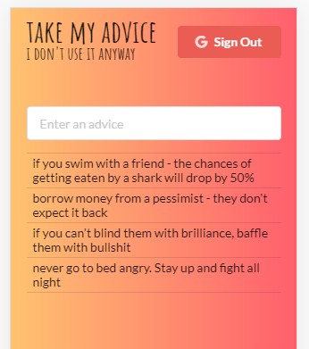

## Advice App

I built this project in order to practice creating and using custom Redux middleware.  
This middleware assures that the structure of Redux store is what we expect it to be. It allows us to validate the structure and type of values in the state.

Need advice? You can find it here.  
Have a good advice? Add it to the list!

#### Install & Start

    $ git clone https://github.com/orvalho/advice
    $ cd advice
    $ npm install
    $ npm start

#### App

#### Stack

-   React
-   React DOM
-   Redux
-   React Redux
-   Redux Thunk
-   tv4
-   JSON Schema
-   Google API client library (auth2)
-   Node SASS
-   Semantic UI
-   Redux DevTools extension
